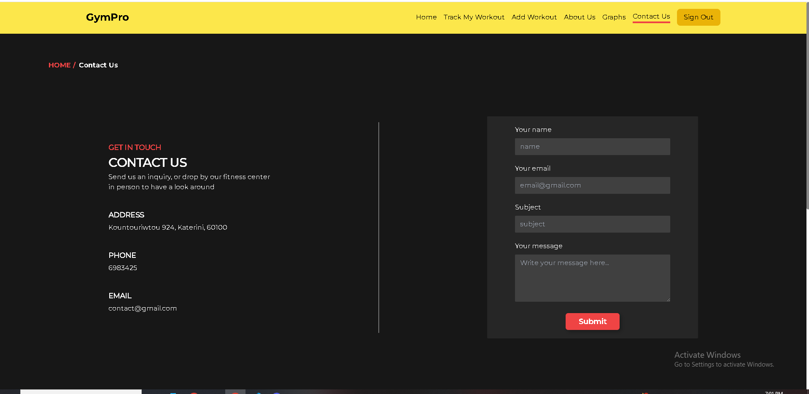

# Spotify Clone

Welcome to the Web Gym App, a workout management tool built with React.js, Tailwind CSS, Express, Node.js, and MongoDB. This application allows you to create an account, log in, and add exercises to your routine. Track your progress over time by viewing previous workouts, and analyze your improvement through detailed diagrams and graphs.

You can see a video of the app here : 

## Table of Contents

- [Features](#features)
- [Screenshots](#screenshots)
- [Usage](#usage)
- [License](#license)
- [Contact](#contact)

## Features

- **Log Exercises**: Add exercises.
- **Exercise History**: View past workouts, including dates and session details.
- **Progress Graphs**: Analyze improvements over time with detailed diagrams and graphs.
- **Exercise Insights**: See key details like category and performance metrics.
- **Search Functionality**: Search for exercises or routines by name or category.
- **User Authentication**: Create an account and log in to save and access your data.

## Screenshots

## Contact

For any questions or feedback, please contact:

- **Your Name**: [foxfireninetails9@gmail.com](mailto:foxfireninetails9@gmail.com)
- **GitHub**: [qbeeeeee](https://github.com/qbeeeeee)
